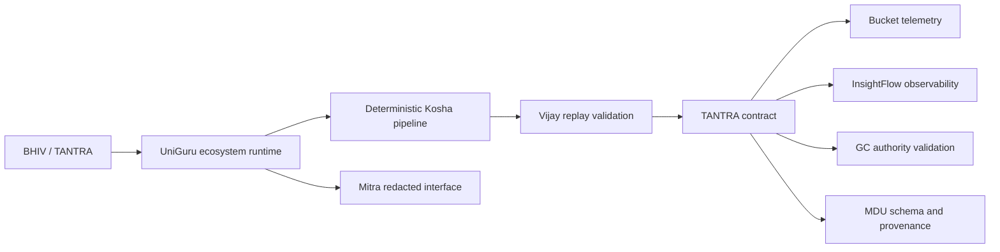

# BHIV Ecosystem Runtime

UniGuru now exposes a governed BHIV ecosystem capability through the runtime API.

## Execution Flow

`BHIV/TANTRA request -> UniGuru ecosystem runtime -> deterministic Kosha pipeline -> Vijay replay validation -> TANTRA contract binding -> Bucket telemetry -> InsightFlow observability -> GC authority validation -> MDU schema/provenance validation -> governed response`



## Interfaces

- Internal execution: `POST /runtime/ecosystem/execute`
- Replay verification: `POST /runtime/ecosystem/replay`
- Mitra governed interface: `POST /mitra/ecosystem/ask`
- Health: `GET /health`
- Readiness: `GET /ready`
- Metrics: `GET /metrics`

The Mitra endpoint returns answer, trace, verification, replay and evidence-pointer fields only. Internal governance validation payloads remain inside the BHIV runtime boundary.

## Evidence

Run:

```powershell
.venv\Scripts\python.exe scripts\run_ecosystem_acceptance.py
```

Generated evidence:

- `review_packets/integration_proof/ecosystem_execution_latest.json`
- `review_packets/integration_proof/replay_verification_latest.json`
- `review_packets/validation_reports/ecosystem_acceptance_report.json`
- `review_packets/logs/ecosystem_acceptance_api_responses.json`
- `review_packets/deployment_proof/ecosystem_deployment_validation.json`

## Production Notes

Bucket telemetry is file-backed in local validation. Set `UNIGURU_BUCKET_TELEMETRY_ENABLED=true`, `UNIGURU_BUCKET_TELEMETRY_ENDPOINT`, and `UNIGURU_BUCKET_TELEMETRY_TOKEN` in BHIV deployment to emit to a remote Bucket collector.
