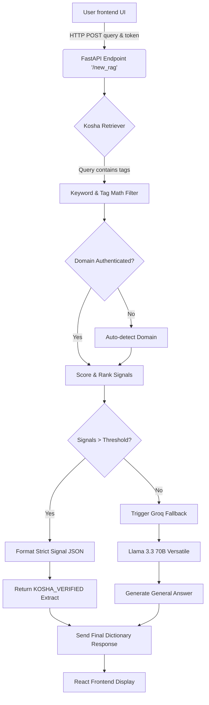

# Final Pipeline Diagram

```mermaid
flowchart TD
    A[User frontend UI] -->|HTTP POST query & token| B(FastAPI Endpoint '/new_rag')
    B --> C{Kosha Retriever}
    
    C -->|Query contains tags| D[Keyword & Tag Math Filter]
    D --> E{Domain Authenticated?}
    E -->|Yes| F[Score & Rank Signals]
    E -->|No| G[Auto-detect Domain]
    G --> F
    
    F --> H{Signals > Threshold?}
    
    H -->|Yes| I[Format Strict Signal JSON]
    I --> J[Return KOSHA_VERIFIED Extract]
    
    H -->|No| K[Trigger Groq Fallback]
    K --> L[Llama 3.3 70B Versatile]
    L --> M[Generate General Answer]
    
    J --> N[Send Final Dictionary Response]
    M --> N
    
    N --> O[React Frontend Display]
```
