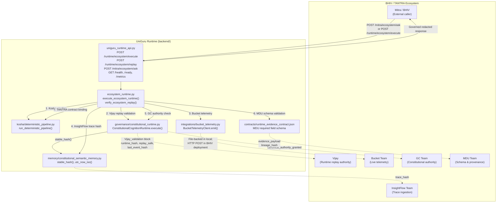

# Architecture Map
## UniGuru BHIV Ecosystem Integration

**Generated:** 2026-07-10

---

## System Architecture



---

## Integration Touchpoints

| # | Touchpoint | Mechanism | Evidence Field |
|---|-----------|-----------|----------------|
| 1 | **Vijay – Runtime Replay** | `ConstitutionalCognitionRuntime.execute()` with `vijay_runtime` arbitrator | `vijay_validation.replay_safe`, `vijay_validation.runtime_hash` |
| 2 | **Bucket – Telemetry** | `BucketTelemetryClient` (file-backed locally; HTTP in BHIV) | `bucket_telemetry.emitted`, `bucket_telemetry.bucket_path` |
| 3 | **InsightFlow – Observability** | `stable_hash(trace_id + runtime_hash)` as trace fingerprint | `insightflow_observability.trace_hash`, `trace_complete` |
| 4 | **GC – Authority Validation** | `ConstitutionalCognitionRuntime` authority enforcement | `gc_validation.authority_enforced`, `canonical_authority_granted` |
| 5 | **MDU – Schema & Provenance** | Field validation against `contracts/runtime_evidence_contract.json` | `mdu_validation.schema_compatible`, `evidence_payload.lineage_hash` |
| 6 | **TANTRA – Contract Binding** | Output contract from Kosha pipeline | `tantra_contract.contract_bound`, `downstream_consumable` |
| 7 | **Mitra – Governed Interface** | Redacted response (no internal governance payloads) | `replay_safe`, `answer`, `verification_status`, `downstream_consumable` |

---

## Data Flow: Execute → Replay → Mitra

```
POST /runtime/ecosystem/execute
  → run_deterministic_pipeline(query)          [Kosha]
  → _build_vijay_validation()                  [ConstitutionalCognitionRuntime]
  → _build_bucket_telemetry()                  [BucketTelemetryClient / file]
  → _build_tantra_contract()                   [Kosha output_contract]
  → _build_insightflow_observability()         [stable_hash]
  → _build_gc_validation()                     [authority_enforced check]
  → _build_mdu_validation()                    [runtime_evidence_contract.json]
  → stable_hash(full_payload) → execution_hash
  → write integration_proof/ecosystem_execution_{trace_id}.json

POST /runtime/ecosystem/replay
  → execute_ecosystem_runtime() × 2 (same trace_id)
  → compare: runtime_hash, last_event_hash, lineage_hash, contract_schema
  → replay_verified = all checks pass

POST /mitra/ecosystem/ask
  → execute_ecosystem_runtime()
  → strip: vijay_validation, gc_validation, mdu_validation
  → return: trace_id, answer, verification_status, replay_safe, contract_schema
```
